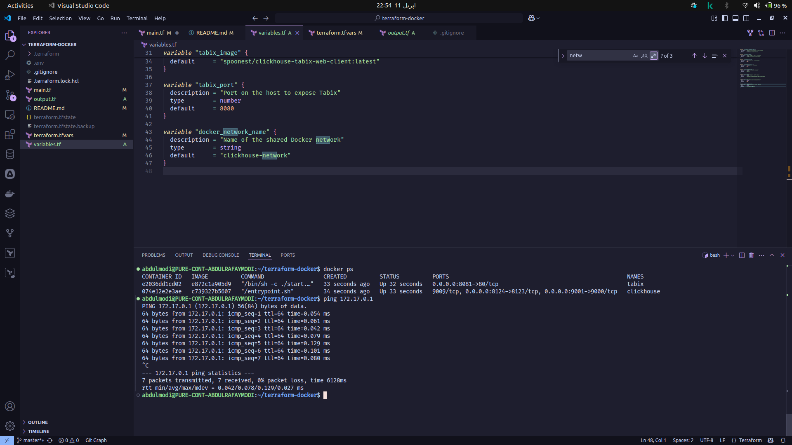

# 🚀 ClickHouse + Tabix Terraform Setup

This Terraform project provisions a local development environment using Docker for [ClickHouse](https://clickhouse.com/) and [Tabix](https://github.com/TabixIO/tabix), a web UI for interacting with ClickHouse.

---

## 📦 What's Included

- **ClickHouse Server** (`yandex/clickhouse-server`)
  - Exposes native port `9000` and HTTP port `8123`
  - Persists data in a local volume (`/click-house/`)
- **Tabix Web UI** (`spoonest/clickhouse-tabix-web-client`)
  - Accessible at `http://localhost:8080`
  - Connects to the ClickHouse server via Docker network

---

## 🧰 Prerequisites

- [Terraform](https://www.terraform.io/downloads)
- [Docker](https://www.docker.com/get-started)
- Optional: [Docker Compose](https://docs.docker.com/compose/) for other local tools

---

## ⚙️ Usage

1. **Initialize Terraform**

    ```bash
    terraform init
    ```

2. **Apply the Infrastructure**

    ```bash
    terraform apply
    ```

    > Confirm when prompted. Containers and network will be created.

3. **Access Services**

    - **ClickHouse HTTP Interface**: [http://localhost:8123](http://localhost:8123) — returns `Ok` (no UI)
    - **Tabix Web UI**: [http://localhost:8080](http://localhost:8080)

---

## 🔑 Default ClickHouse Credentials

- **Host**: `clickhouse-server-tutorial`
- **Port**: `8123`
- **User**: `default`
- **Password**: `password`

Use these credentials to connect from Tabix or your ClickHouse client.

---

## 📁 Data Persistence

ClickHouse data is stored locally at:

`/click-house/`


Modify the volume path in the Terraform file if you'd like to persist data elsewhere.

---

## 🧼 Clean Up

To remove all resources provisioned by Terraform:

```bash
terraform destroy
```
---

📝 Notes

    This setup uses Docker's default bridge network and should be used for local development/demo purposes only.

    For production-like setups, consider using Compose, Kubernetes, or cloud-native services with Terraform modules.

Happy Querying! 🎉

---

FYI Documentations was generate by ChatGPT

### Result
